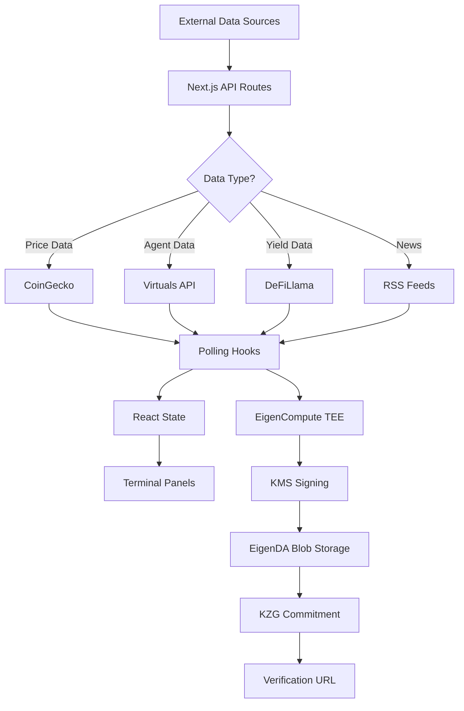

# CORTEX — The Bloomberg Terminal for the AI Agent Economy

<p align="center">
  
  
  
  
</p>

> **CORTEX** is a dense, real-time, cryptographically-verifiable intelligence terminal for the AI agent economy. Every data point is TEE-attested via EigenCompute and stored on EigenDA for permanent verifiability.

---

## Table of Contents

- [Overview](#overview)
- [The Problem](#the-problem)
- [Features](#features)
- [Architecture](#architecture)
- [Data Flow](#data-flow)
- [Tech Stack](#tech-stack)
- [Getting Started](#getting-started)
- [Deployment](#deployment)
- [Attestation](#attestation)
- [API Endpoints](#api-endpoints)
- [Panel Reference](#panel-reference)

---

## Overview

The AI agent economy is exploding:

| Metric | Value |
|--------|-------|
| Virtuals aGDP | $479M |
| Active Agents (Virtuals) | 2,200+ |
| Clanker All-Time Volume | $7.62B |
| Bittensor Market Cap | $1.98B |

But there's no institutional-grade intelligence layer for it. **CORTEX fills that gap.**

---

## The Problem

| Existing Solutions | Gap |
|-------------------|-----|
| **Bloomberg Terminal** | Reports on assets, not AI agents making decisions |
| **Cookie.fun** | Surface-level leaderboard, no performance data |
| **Token Terminal** | Protocol fundamentals, no agent-specific metrics |
| **Perplexity** | General-purpose AI, not agent-specific, not verifiable |

**CORTEX's Moat:**
- Cryptographic trust — every number TEE-attested
- Real economic stakes — model benchmarks backed by ETH
- Institutional-grade density — Bloomberg aesthetic

---

## Features

### Real-Time Panels

| Panel | Description |
|-------|-------------|
| **AAI-50 Index** | S&P 500 equivalent for top 50 AI agents |
| **Agent Risk Score (ARS)** | Credit score for AI agents, TEE-computed |
| **x402 Flow Graph** | Agent-to-agent micropayment visualization |
| **Attestation Stream** | Live TEE-verified activity feed |
| **Turing Spread** | Implied "intelligence premium" per agent |
| **Model Battlecard** | Real economic stake-backed model benchmarks |
| **DeFAI Yields** | Real-time yield rates across 178+ protocols |
| **Consensus Layer** | Multi-agent analysis aggregation |
| **Agent Mortality** | Death rates, survival curves by framework |

### Keyboard Navigation

| Key | Panel |
|-----|-------|
| `1` | AAI-50 |
| `2` | Mortality |
| `3` | ARS |
| `4` | Consensus |
| `5` | Token Watchlist |
| `6` | Turing Spread |
| `7` | Actuarial |
| `8` | x402 Flow |
| `9` | DeFAI Yields |
| `0` | Attestations |
| `n` | News |
| `s` | Status Overlay |

---

## Architecture

```
┌─────────────────────────────────────────────────────────────────────────┐
│                              CORTEX TERMINAL                            │
├─────────────────────────────────────────────────────────────────────────┤
│  ┌─────────────┐  ┌─────────────┐  ┌─────────────┐  ┌─────────────────┐ │
│  │   AAI-50    │  │    ARS      │  │ x402 Flow   │  │   Attestation   │ │
│  │   Panel     │  │   Panel     │  │   Panel     │  │     Panel       │ │
│  └─────────────┘  └─────────────┘  └─────────────┘  └─────────────────┘ │
│  ┌─────────────┐  ┌─────────────┐  ┌─────────────┐  ┌─────────────────┐ │
│  │   Turing    │  │   DeFAI     │  │  Consensus  │  │     Mortality   │ │
│  │   Spread    │  │   Yields    │  │   Layer     │  │     Panel       │ │
│  └─────────────┘  └─────────────┘  └─────────────┘  └─────────────────┘ │
├─────────────────────────────────────────────────────────────────────────┤
│                          COMMAND BAR (LLM)                              │
└─────────────────────────────────────────────────────────────────────────┘
                                    │
                                    ▼
┌─────────────────────────────────────────────────────────────────────────┐
│                              API LAYER                                  │
├─────────────────────────────────────────────────────────────────────────┤
│  /api/prices  │  /api/agents  │  /api/ars  │  /api/yields  │  /api/x402│
│  /api/agdp    │  /api/tokens  │  /api/news │  /api/network │  /api/... │
└─────────────────────────────────────────────────────────────────────────┘
                                    │
                                    ▼
┌─────────────────────────────────────────────────────────────────────────┐
│                            DATA SOURCES                                  │
├─────────────────────────────────────────────────────────────────────────┤
│  ┌──────────────┐  ┌──────────────┐  ┌──────────────┐  ┌────────────┐  │
│  │  CoinGecko   │  │   Virtuals   │  │  Bittensor   │  │  Cookie    │  │
│  │   (prices)   │  │    (aGDP)    │  │  (subnets)  │  │   .fun     │  │
│  └──────────────┘  └──────────────┘  └──────────────┘  └────────────┘  │
│  ┌──────────────┐  ┌──────────────┐  ┌──────────────┐  ┌────────────┐  │
│  │  DeFiLlama   │  │    Olas     │  │   OpenRouter │  │    RSS     │  │
│  │   (yields)   │  │   (PoAA)    │  │   (LLM)     │  │   (news)   │  │
│  └──────────────┘  └──────────────┘  └──────────────┘  └────────────┘  │
└─────────────────────────────────────────────────────────────────────────┘
```

---

## Data Flow

```
┌──────────────────┐      ┌──────────────────┐      ┌──────────────────┐
│   External APIs  │ ──▶ │   Next.js API    │ ──▶ │   Frontend UI    │
│  (CoinGecko,      │      │   (polling,      │      │   (real-time    │
│   Virtuals, etc)  │      │    SSE streams)  │      │    panels)       │
└──────────────────┘      └──────────────────┘      └──────────────────┘
                                    │
                                    ▼
                         ┌──────────────────┐
                         │   EigenCompute   │
                         │   (TEE Runtime)  │
                         │  ┌────────────┐  │
                         │  │ KMS Sign   │  │
                         │  │ Key / Attest│  │
                         │  └────────────┘  │
                         └──────────────────┘
                                    │
                                    ▼
                         ┌──────────────────┐
                         │    EigenDA       │
                         │  (Blob Storage)  │
                         │  ┌────────────┐  │
                         │  │ KZG Commt  │  │
                         │  │ / Verify   │  │
                         │  └────────────┘  │
                         └──────────────────┘
```

### Detailed Flow



---

## Tech Stack

| Layer | Technology |
|-------|------------|
| **Frontend** | React, Next.js 14, TypeScript |
| **Styling** | CSS Grid, Bloomberg-style dense layout |
| **State** | React hooks (usePolling, useSSE) |
| **LLM** | OpenRouter (command bar) |
| **Data** | CoinGecko, Virtuals, Bittensor, DeFiLlama, Olas, Cookie.fun |
| **Compute** | EigenCompute (Intel TDX TEE) |
| **Storage** | EigenDA (KZG blob storage) |

---

## Getting Started

### Prerequisites

- Node.js 18+
- npm or yarn
- Docker (for EigenDA proxy)

### Local Development

```bash
# Clone the repo
git clone https://github.com/zeeshan8281/Cortex.git
cd Cortex

# Install dependencies
npm install

# Run development server
npm run dev

# Open http://localhost:3000
```

### Environment Variables

```bash
# .env.local
COINGECKO_API_KEY=your_key
OPENROUTER_API_KEY=your_key
VIRTUALS_API_KEY=your_key
EIGENDA_PROXY_URL=http://127.0.0.1:3100
```

---

## Deployment

### 1. Deploy to EigenCompute

```bash
# Install ecloud CLI
npm install -g @layr-labs/ecloud-cli

# Authenticate
ecloud auth login

# Create app
ecloud compute app create --name cortex --language typescript

# Deploy (build from Dockerfile)
ecloud compute app deploy
```

### 2. Set Environment Variables

```bash
ecloud compute app env set \
  COINGECKO_API_KEY=your_key \
  OPENROUTER_API_KEY=your_key
```

---

## Attestation

### How It Works

Every significant computation in CORTEX is:

1. **Executed inside EigenCompute TEE** — hardware-isolated Intel TDX
2. **Signed with the TEE's KMS key** — unique cryptographic identity
3. **Stored on EigenDA** — permanent, verifiable blob storage

### Verification

```
┌─────────────────────────────────────────────────────────────┐
│                  ATTESTATION RECEIPT                        │
├─────────────────────────────────────────────────────────────┤
│  App ID:        cortex-xxx                                  │
│  Timestamp:     2026-03-03T14:23:01Z                      │
│  Platform:      Intel TDX (EigenCompute)                    │
│  KMS Fingerprint: sha256:abc123...                         │
│                                                             │
│  Data:         { "attestation": {...} }                    │
│  EigenDA Commitment: 0xdef456...                           │
│                                                             │
│  Verify:       https://verify-sepolia.eigencloud.xyz       │
│  View Blob:   https://blobs-sepolia.eigenda.xyz/blobs/     │
└─────────────────────────────────────────────────────────────┘
```

### Store Data on EigenDA

```bash
# Via proxy
curl -s -X POST "http://127.0.0.1:3100/put?commitment_mode=standard" \
  -H "Content-Type: application/json" \
  -d '{"attestation": {...}, "timestamp": "2026-03-03T14:23:01Z"}'
```

---

## API Endpoints

| Endpoint | Description | Polling Interval |
|----------|-------------|------------------|
| `/api/prices` | ETH, VIRTUAL prices | 30s |
| `/api/agents` | AAI-50, agent counts | 60s |
| `/api/agdp` | aGDP metrics | 60s |
| `/api/ars` | Agent Risk Scores | 120s |
| `/api/yields` | DeFAI protocol yields | 60s |
| `/api/x402` | x402 flow data | 30s |
| `/api/tokens` | Token watchlist | 30s |
| `/api/network` | Chain health | 20s |
| `/api/history` | AAI-50 history | 600s |
| `/api/news` | RSS news feed | 180s |
| `/api/attestations/stream` | SSE attestation stream | real-time |

---

## Panel Reference

### Top Bar
- TEE Status indicator (LIVE/DEGRADED/DOWN)
- Total agent count
- aGDP with 24h change
- ETH and VIRTUAL prices
- AAI-50 index value

### AAI-50 Panel
Top 50 AI agents ranked by economic output, reputation, and performance.

### Agent Risk Score (ARS)
Credit score (0-1000) for AI agents:
- STRONG: 800-1000
- GOOD: 650-799
- MEDIUM: 500-649
- LOW: 350-499
- CRITICAL: 0-349

### x402 Flow Graph
Agent-to-agent micropayment visualization showing:
- Payment flows between agents
- 1-hour total volume
- 7-day trend
- Largest single payment

### Attestation Stream
Live feed of TEE-verified events:
- Match results
- PoAA completions
- Bittensor jobs
- Griffin trades

---

## License

MIT

---

## Related Links

- [MoltLeague](https://github.com/zeeshan8281/moltleague) — Competition platform backing model battlecards
- [EigenLayer](https://eigenlayer.xyz) — Restaking infrastructure
- [EigenCompute](https://eigencloud.xyz) — TEE compute platform
- [EigenDA](https://eigenda.xyz) — Data availability layer
- [x402 Protocol](https://x402.org) — Agent-to-agent micropayments

---

<p align="center">
  <em>Built with TEE trust. Stored on EigenDA. Verified everywhere.</em>
</p>
